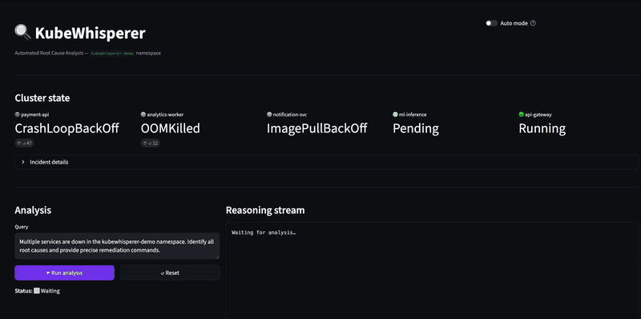

# KubeWhisperer

> Correlate Kubernetes signals, detect GitOps drift, and get validated remediation patches — with a human approval gate before anything touches production.

[](https://github.com/a1h8/KubeWhisperer/actions/workflows/ci.yml)
[](#validated-scenarios)
[](https://www.python.org)
[](LICENSE)

KubeWhisperer correlates Kubernetes events, Helm drift, Prometheus alerts, OTel traces and Loki logs into a single evidence-grounded root cause analysis. Six failure patterns are validated end-to-end in CI — no live cluster, no LLM required.

**Air-gapped by default** — Ollama + Mistral, no data leaves your infrastructure. Groq, Anthropic, OpenAI and Google Gemini are drop-in via `LLM_PROVIDER`.



--- 

## Why it matters

Most Kubernetes outages are not caused by a single failing pod.

When payment-service crashes, the on-call engineer opens five tabs simultaneously: pod logs, Kubernetes events, Helm history, Prometheus graphs, and the GitOps repo. Under pressure, at 2 AM, with three Slack threads open. The root cause is rarely where the alert fired — it's three hops away in a misconfigured Helm value or a drift between what was declared and what actually runs.

KubeWhisperer reduces that cognitive load. It correlates events, Helm drift, Prometheus signals and OTel traces into a single evidence-grounded root cause analysis — ranked by confidence, with a human approval gate before any remediation command touches production.

## Current status

| Capability | Status |
|---|---|
| Offline deterministic RCA pipeline | Proven in CI (h001–h006) |
| SQLite-backed session + FAISS persistence | Shipped — survives server restarts |
| Multi-signal collectors (Prometheus, OTel, Loki) | Implemented / configurable |
| Live cluster usage | Available with kubeconfig |
| GitOps patching | Human-gated, dry-run first |

---

## Demo

Three scenarios on a real k3d cluster — no mocks, no hardcoded answers.

**What the output looks like:**

```
════════════════════════════════════════════════════════════════════
  INCIDENT SUMMARY
════════════════════════════════════════════════════════════════════
  Severity    : HIGH
  Namespace   : kubewhisperer-demo
  Confidence  : MEDIUM
  Impacted    : payment-service, ml-inference, notification-service

  Root cause  :
    payment-service is in CrashLoopBackOff due to repeated container
    failures. ml-inference cannot pull its image (ImagePullBackOff).
    notification-service is missing a required environment variable.

  Key evidence:
    • [447×] BackOff on Pod/payment-service-58555ff9b6-4bxv2
      "Back-off restarting failed container payment-service"
    • [  1×] Failed on Pod/ml-inference-6c7dbf6d5f-2nlsr
      "Failed to pull image: not found"

  Proposed fix:
    $ kubectl rollout restart deployment/payment-service -n kubewhisperer-demo
    $ kubectl set image deployment/ml-inference ml-inference=<correct-image>
════════════════════════════════════════════════════════════════════
  Confidence: MEDIUM
  Approve and apply remediation? [approve/reject]: approve
  ✓ Remediation approved — commands above should be applied.
```

---

### 1 · Multi-failure RCA (air-gapped, Mistral)

Five services down simultaneously. KubeWhisperer identifies each root cause independently, ranks them by evidence weight, and separates root causes from cascades — entirely local, no data leaves the machine.

<video src="https://github.com/user-attachments/assets/02a5d62b-d61e-4a70-b081-4d98d168366a" autoplay loop muted playsinline width="100%"></video>

---

### 2 · Human approval gate

The LLM proposes remediation commands. Execution is gated: the SRE reviews the evidence, types `approve` or `reject`. Nothing touches the cluster without explicit sign-off.

<video src="https://github.com/user-attachments/assets/c0ad7270-5dcb-4783-9221-a3efb523212b" autoplay loop muted playsinline width="100%"></video>

---

### 3 · No false positives — healthy service confirmed

`api-gateway` is running normally. KubeWhisperer queries the same pipeline and correctly returns HIGH confidence with no remediation needed. Signal-to-noise ratio matters.

<video src="https://github.com/user-attachments/assets/0e884e44-a083-46ab-a3aa-8396e7a70cd0" autoplay loop muted playsinline width="100%"></video>

---

```bash
# Air-gapped (local Mistral)
LLM_PROVIDER=ollama python demo/run_rca.py --yes

# Connected demo (Groq, faster)
LLM_PROVIDER=groq python demo/run_rca.py --yes
```

→ [Full demo guide](docs/demo.md)

---

## Quick start

**Prerequisites:** Python 3.11+, a Kubernetes cluster reachable via kubeconfig, and one LLM provider configured in `.env`.

```bash
git clone https://github.com/a1h8/KubeWhisperer.git
cd KubeWhisperer
pip install -r requirements.txt

cp .env.example .env
# Edit .env: KUBECONFIG, LLM_PROVIDER, KUBE_NAMESPACES
# LLM_PROVIDER=ollama  → ollama pull mistral  (local, no data leaves infra)
# LLM_PROVIDER=groq    → set GROQ_API_KEY     (fast, free tier)
# LLM_PROVIDER=anthropic|openai|google → set corresponding API key

streamlit run ui/app.py
```

### Try without a cluster

The **Integration Tests** tab runs entirely offline — no cluster, no Ollama needed:

1. `streamlit run ui/app.py`
2. Go to **🧪 Integration Tests**
3. Select any `h00N_*` case from the dropdown
4. Mode defaults to **🔬 Pipeline trace** — pipeline runs automatically
5. Explore all 10 steps: tokenizer → retrieval → anchors → drift → confidence → proposed fixes

---

## Validated scenarios

Six failure patterns proven end-to-end in CI — no cluster, no Ollama required.

| Scenario | Case | What it proves |
|---|---|---|
| CrashLoopBackOff — missing dependency | h001 | BFS graph traversal, BM25+FAISS retrieval, anchor detection, confidence scoring, fix proposals |
| ImagePullBackOff — registry auth / tag drift | h002 | Helm drift detection, `drift.*` annotations, image proposal generation |
| OOMKilled — memory limit drift | h003 | Helm declared-vs-observed diff, `anchor_fix_hints()` → `helm upgrade --set` |
| Missing ConfigMap / Secret at pod start | h004 | `DeploymentReadinessDetector`, `missing.*` annotations, `kubectl create` hints |
| NetworkPolicy egress block | h005 | `netpol.*` annotations, `kubectl edit networkpolicy` hints |
| RBAC — missing ClusterRoleBinding | h006 | SA exists but no binding detected, `kubectl create clusterrolebinding` hint |

Each case runs the full pre-LLM pipeline: graph construction → hybrid retrieval (BM25 + FAISS + RRF) → context building → anchor/drift/policy scoring → proposal generation.

---

## How it works

The LLM is constrained by retrieved evidence. KubeWhisperer ranks hypotheses from deterministic signals first — ontology topology, anchor violations, drift, policies and resolved incidents — then uses the LLM only to produce an evidence-grounded RCA.

Confidence routing uses beam search: two consecutive LOW results on the same hypothesis path trigger an immediate switch to the next candidate, and archived paths re-rank remaining candidates using signals from the failed analysis.

**Pipeline:**

```
K8s events + Prometheus + OTel/Loki + Helm values
        ↓
Ontology graph + anchor drift detection
        ↓
BM25 + FAISS + RRF hybrid retrieval
        ↓
Beam-search hypothesis ranking
        ↓
LLM root-cause analysis (evidence-grounded)
        ↓
Dry-run validation → human review gate → GitOps patch
```

---

## Documentation

| Document | Content |
|---|---|
| [Architecture](docs/architecture.md) | Full pipeline diagram, LangGraph workflow, evidence-first hypothesis generation, beam search routing, anchor system design, drift detection, PatchTST |
| [REST API](docs/api.md) | FastAPI endpoints, session lifecycle, request/response examples, SSE stream |
| [UI reference](docs/ui.md) | Streamlit tabs, pipeline trace steps, anchor pivot table, reasoning journey, router decisions |
| [Test cases](docs/test-cases.md) | h001–h006 validated scenarios, case format, adding a new case, CI coverage |
| [Project layout](docs/project-layout.md) | Full directory tree, RBAC |
| [Roadmap](docs/roadmap.md) | Done and next |
| [Configuration](docs/configuration.md) | All `.env` variables, hybrid retrieval tuning, source weights |
| [Deployment](docs/deployment.md) | Docker, k3d, production K8s |

---

## Current limitations

This is a portfolio-grade prototype. It demonstrates real engineering decisions, but several constraints are intentional or known:

- **Validated cases: h001–h006 only.** h007–h012+ (Helmfile multi-release, MCTS routing, Slack/PagerDuty, RBAC-aware scoping) are in the roadmap, not yet implemented.
- **Single-cluster.** Multi-cluster support is not yet wired end-to-end.
- **No auto-remediation in production.** The human approval gate is by design; autonomous execution is not implemented.
- **LLM performance is local-hardware-dependent.** Mistral via Ollama is functional on a MacBook M-series; slower on CPU-only machines.
- **No real-time alerting integration.** Prometheus and Loki data is pulled on demand, not streamed.

See [Roadmap](docs/roadmap.md) for what's next.

---

## License

[Apache 2.0](LICENSE)
