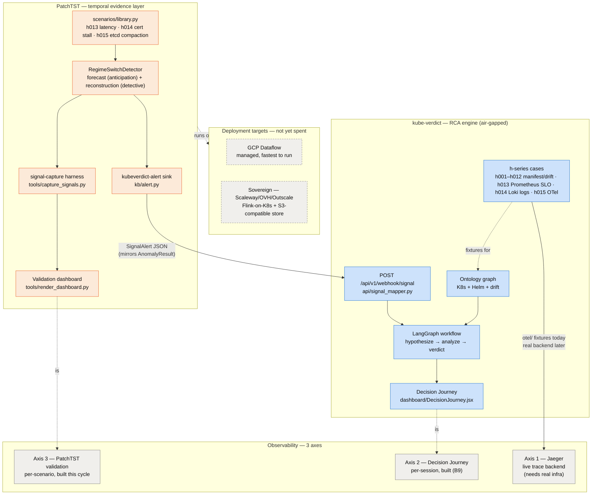

# KubeVerdict ↔ PatchTST — relationship map

One picture of how the two repos divide responsibility, and where the pieces
built in this cycle (native signal webhook, h013, h014, h015, the 3 observability axes)
sit relative to each other. Detail lives in [architecture.md](architecture.md)
(kube-verdict) and PatchTST's `docs/ARCHITECTURE.md` / `docs/SIGNAL_VALIDATION.md`
— this is the map, not the territory.

## Reading it

- **kube-verdict never re-implements detection** — it receives an already
  -aggregated `SignalAlert` (severity, score, method, labels), never a raw
  time series. PatchTST never re-implements RCA — it stops at "here's an
  anomalous signal," it doesn't reason about root cause.
- **The webhook is the only coupling point.** `POST /api/v1/webhook/signal`
  (kube-verdict) ↔ `kubeverdict-alert` sink (PatchTST) — one schema
  (`SignalAlert` / `AnomalyResult`), one direction (push), best-effort (a
  failed POST never blocks the PatchTST pipeline).
- **h013, h014 and h015 sit in both repos on purpose** — PatchTST validates *can
  the detector see this pattern* (synthetic time series, offline); kube-verdict
  validates *can the RCA pipeline explain it once evidence arrives*, one signal
  each: h013 via Prometheus SLO burn-rate / p99-p95 alert fixtures on a pod
  Kubernetes reports healthy, h014 via Loki log fixtures (expired certificate,
  pods Running but not ready), h015 via OTel trace fixtures. Same scenarios, two
  different offline-first checks, no live cluster or cloud spend needed for
  either.
- **Axis 1 (Jaeger) is the one dashed line that still means real
  infrastructure** — axes 2 and 3 are both already free (local files /
  existing session store); deploying the actual observability stack (and
  picking GCP vs. a sovereign provider) is the one step in this whole map
  that isn't done by just writing more code.
